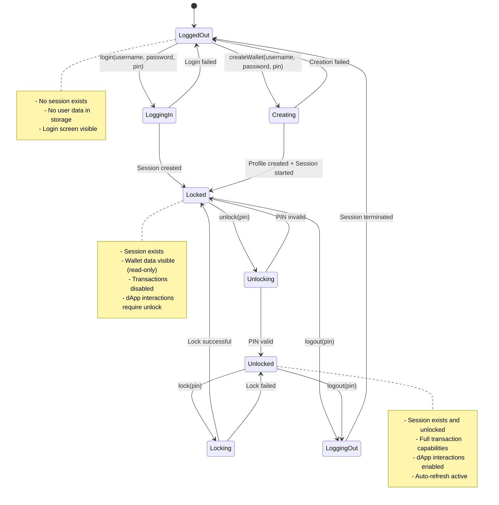
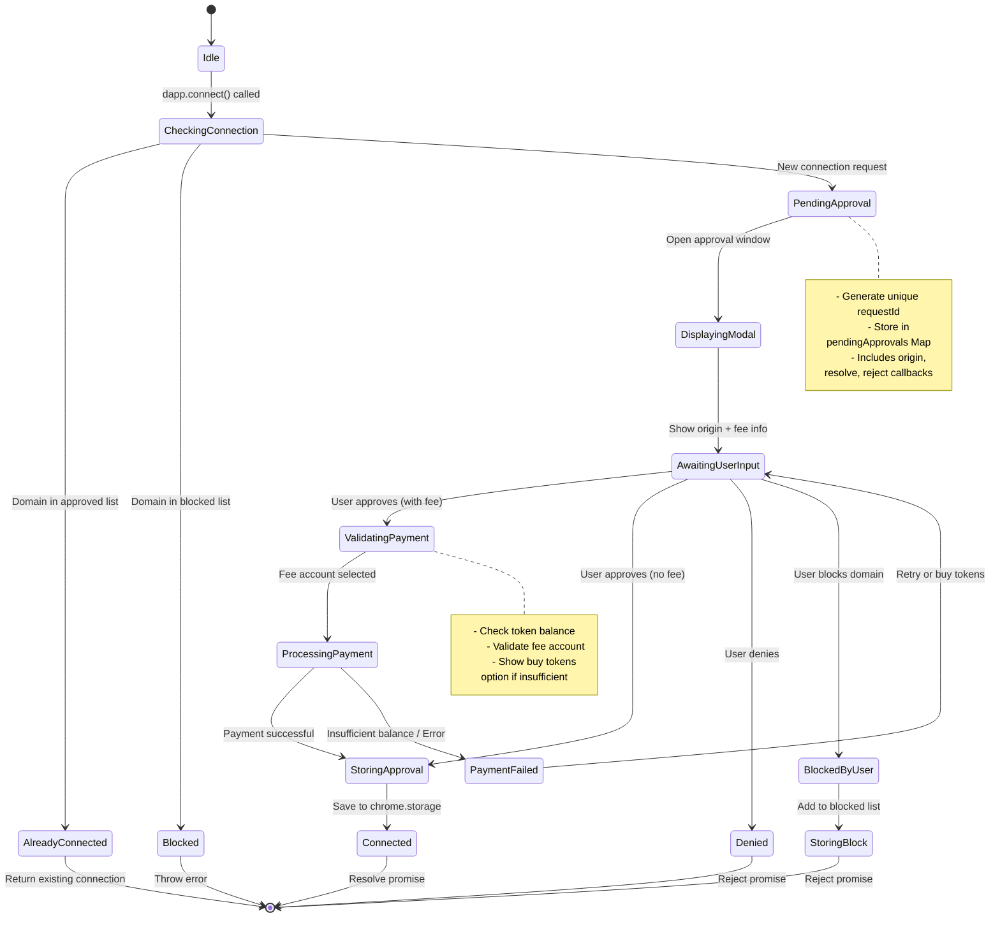
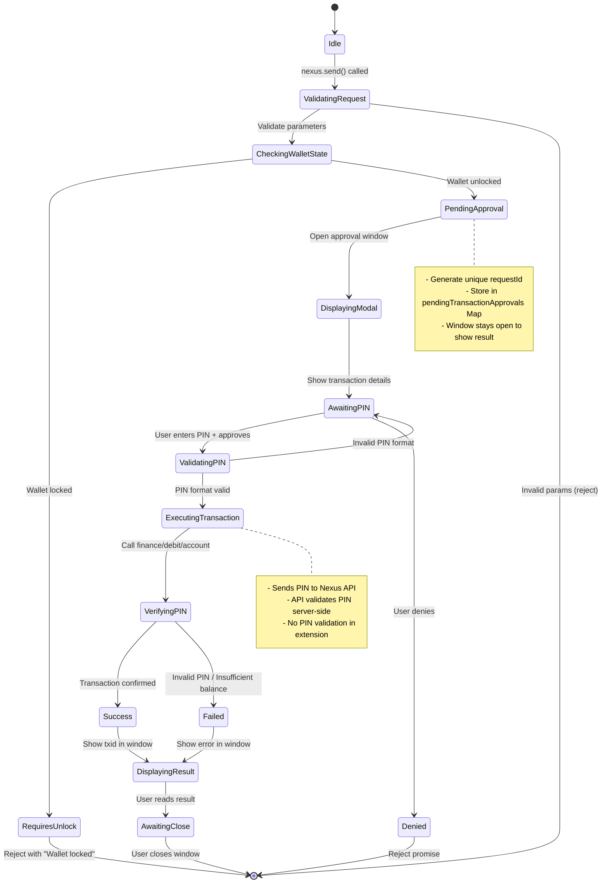
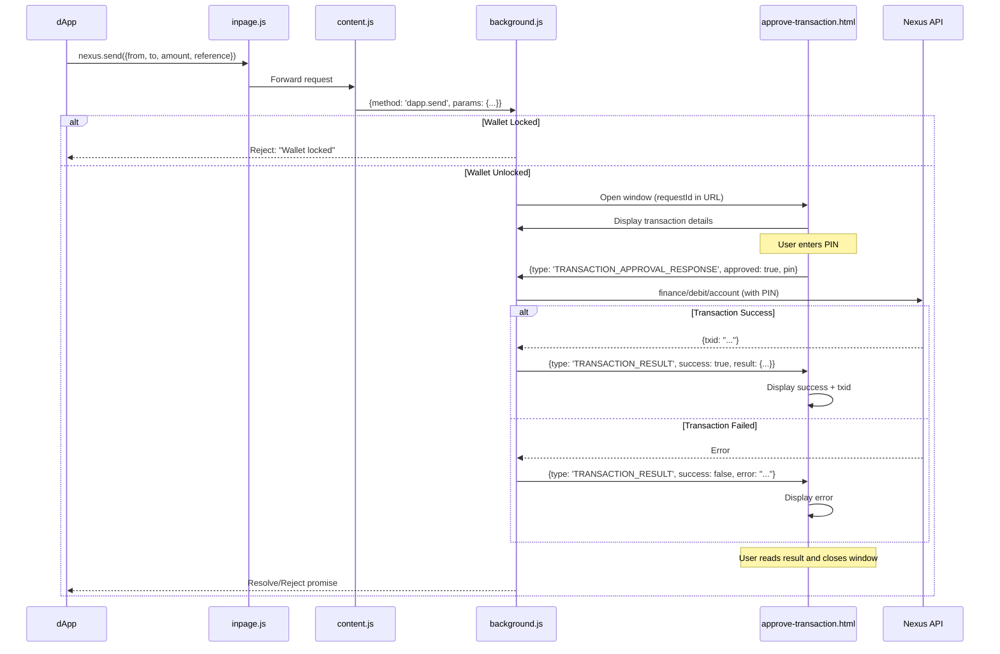
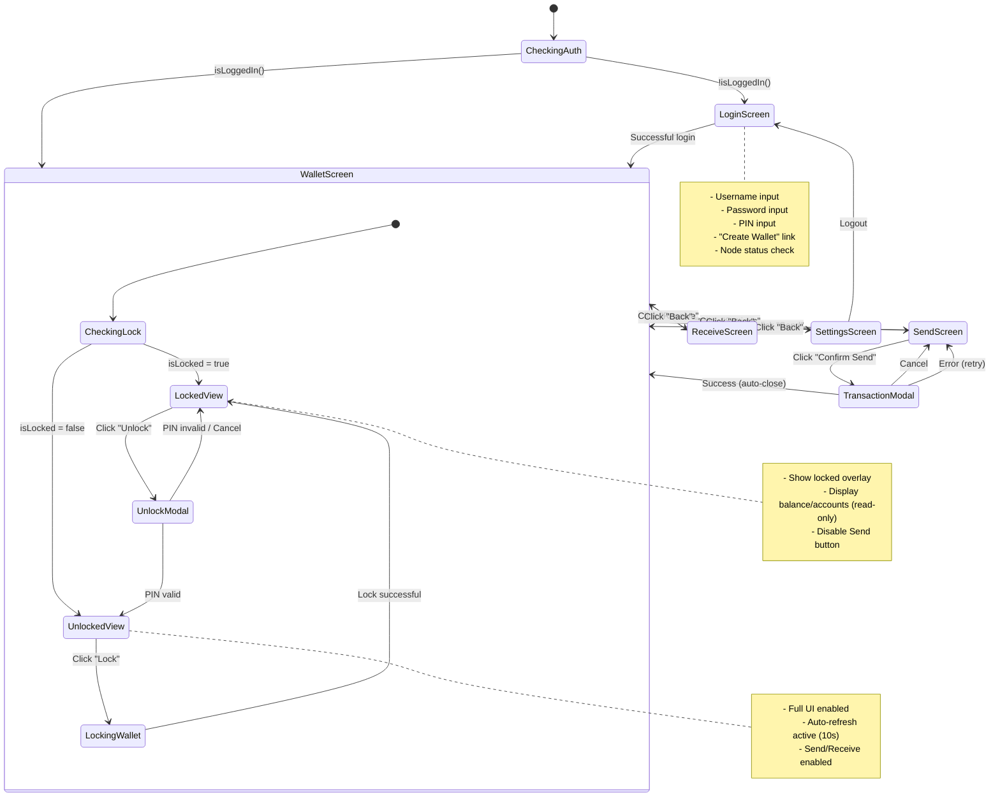
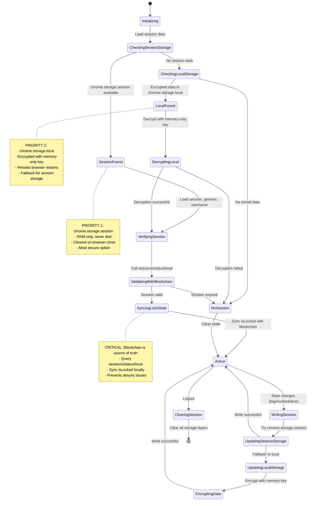
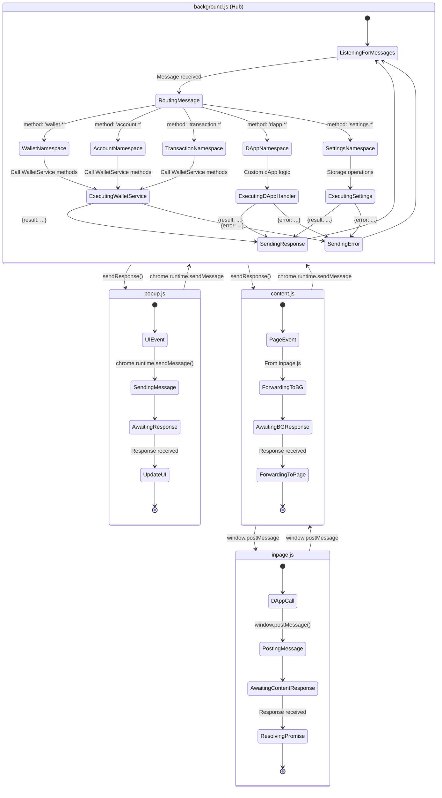

# Q-Wallet State Machine Diagrams

This document describes the various state machines in Q-Wallet's architecture.

## 1. Wallet Session State Machine

The wallet has three primary states related to user authentication and session management:



### State Properties

| State | session | isLocked | Capabilities |
|-------|---------|----------|-------------|
| **LoggedOut** | `null` | `true` | View login screen only |
| **Locked** | `<session-id>` | `true` | View balances, accounts, history (read-only) |
| **Unlocked** | `<session-id>` | `false` | Full wallet operations, transactions, dApp interactions |

### Key Transitions

- **Login**: Creates new session on Nexus blockchain, attempts auto-unlock with PIN
- **Unlock**: Calls `sessions/unlock/local` API, saves PIN to session storage
- **Lock**: Calls `sessions/lock/local` API, maintains session but disables transactions
- **Logout**: Calls `sessions/terminate/local` API, clears all local session data
- **Lock Status Sync**: On initialization, `verifyLockStatus()` queries blockchain and syncs local state

---

## 2. dApp Connection Approval State Machine

Handles dApp connection requests with approval workflow:



### Connection States

| State | Storage | Window | Promise |
|-------|---------|--------|---------|
| **Idle** | None | None | N/A |
| **PendingApproval** | `pendingApprovals` Map | Opening | Pending |
| **AwaitingUserInput** | `pendingApprovals` Map | Open | Pending |
| **Connected** | `approvedDomains` (chrome.storage) | Closed | Resolved |
| **Blocked** | `blockedDomains` (chrome.storage) | Closed | Rejected |

### Message Flow

1. **dApp → inpage.js**: `nexus.connect({fee: {...}})`
2. **inpage.js → content.js**: Forward request
3. **content.js → background.js**: `{method: 'dapp.connect', params: {...}}`
4. **background.js**: Check approved/blocked lists
5. **background.js → approve-connection.html**: Open window with URL params
6. **approve-connection.js → background.js**: `{type: 'CONNECTION_RESPONSE', approved: true/false}`
7. **background.js**: Resolve/reject promise, store decision
8. **background.js → inpage.js**: Return result
9. **inpage.js → dApp**: Promise resolves/rejects

---

## 3. Transaction Approval State Machine

Handles dApp transaction requests with PIN validation:



### Transaction Request Flow



---

## 4. Popup UI Screen State Machine

The popup.html uses screen-based navigation:



### Screen Visibility Matrix

| Screen | Condition | Elements Shown |
|--------|-----------|----------------|
| **LoginScreen** | `!wallet.isLoggedIn()` | Username, password, PIN inputs, node selector |
| **WalletScreen** | `wallet.isLoggedIn()` | Balance, accounts, transactions, lock state |
| **WalletScreen (Locked)** | `wallet.isLoggedIn() && wallet.isLocked` | + Locked overlay, unlock button |
| **WalletScreen (Unlocked)** | `wallet.isLoggedIn() && !wallet.isLocked` | + Send/Receive buttons active, auto-refresh |
| **SendScreen** | User navigation | From account, to address, amount, reference fields |
| **ReceiveScreen** | User navigation | Account address, QR code |
| **SettingsScreen** | User navigation | Node URL, logout, version info |

---

## 5. Storage State Synchronization

Q-Wallet uses multiple storage layers with priority ordering:



### Storage Priority System

1. **chrome.storage.session** (Preferred)
   - RAM-only storage (Manifest V3 feature)
   - Automatically cleared when browser closes
   - No disk persistence
   - Used for: session, genesis, username, isLocked, pin

2. **chrome.storage.local** (Fallback)
   - Persistent storage (survives browser restart)
   - Data encrypted with memory-only key
   - Used for: Encrypted session data, approved/blocked domains, node URL

3. **Nexus Blockchain** (Source of Truth)
   - Session lock state queried on initialization
   - `verifyLockStatus()` syncs local state with blockchain
   - Prevents state desynchronization

### Storage Data Flow

```
User Action (Login/Unlock/Lock)
    ↓
Wallet State Change (this.isLocked = true/false)
    ↓
Storage.saveSession({session, genesis, username, isLocked})
    ↓
Try chrome.storage.session.set() → Success ✓
    ↓ (Fallback)
Try chrome.storage.local.set(encrypted) → Success ✓
    ↓
State Persisted
```

---

## 6. Message Passing Architecture

The extension uses a hub-and-spoke message passing model:



### Message Namespaces

| Namespace | Methods | Handler |
|-----------|---------|---------|
| **wallet.*** | login, logout, unlock, lock, create | WalletService |
| **account.*** | getBalance, listAccounts, getAccount | WalletService |
| **transaction.*** | send, getHistory, getStakeInfo | WalletService |
| **dapp.*** | connect, connectWithFee, send, getInfo | Custom handlers in background.js |
| **settings.*** | setNodeUrl, getNodeUrl | StorageService |

### Example Message Flow

```javascript
// popup.js sends
{
  method: 'wallet.login',
  params: {username: 'alice', password: '***', pin: '***'}
}

// background.js receives → routes to WalletService.login()

// background.js responds
{
  result: {success: true, genesis: '0x...', username: 'alice', isLocked: false}
}
// OR
{
  error: 'Invalid credentials'
}
```

---

## 7. Security State Transitions

Critical security boundaries and state transitions:

```mermaid
stateDiagram-v2
    [*] --> Untrusted
    
    state "Memory-Only Zone" as memory {
        [*] --> PINInMemory
        PINInMemory --> PINUsed: Transaction/Unlock
        PINUsed --> PINCleared: Operation complete
        PINCleared --> [*]
        
        note right of PINInMemory
            PIN only in:
            - chrome.storage.session (RAM)
            - Function parameters
            - Never logged
            - Cleared on logout
        end note
    }
    
    state "Encrypted Zone" as encrypted {
        [*] --> SessionEncrypted
        SessionEncrypted --> SessionDecrypted: Memory-only key
        SessionDecrypted --> SessionEncrypted: Browser close
        
        note right of SessionEncrypted
            Fallback storage:
            - chrome.storage.local
            - Encrypted with memory key
            - Key never persisted
        end note
    }
    
    state "Blockchain Validation" as blockchain {
        [*] --> ValidatingSession
        ValidatingSession --> SessionValid: sessions/status/local
        ValidatingSession --> SessionExpired: Invalid response
        
        SessionValid --> CheckingLockState
        CheckingLockState --> UnlockedOnChain: unlocked.transactions = true
        CheckingLockState --> LockedOnChain: unlocked.transactions = false
        
        note right of blockchain
            Source of truth:
            - Session validity
            - Lock state
            - Transaction authorization
        end note
    }
    
    state "dApp Security Boundary" as dapp {
        [*] --> CheckingOrigin
        CheckingOrigin --> Blocked: In blocked list
        CheckingOrigin --> Approved: In approved list
        CheckingOrigin --> RequiresApproval: New origin
        
        RequiresApproval --> UserApproval: Open modal
        UserApproval --> Approved: User approves
        UserApproval --> Blocked: User blocks
        
        Approved --> EnforcingHTTPS: All dApp calls
        EnforcingHTTPS --> AllowRequest: HTTPS enforced
        EnforcingHTTPS --> BlockRequest: HTTP detected
        
        note right of dapp
            Domain isolation:
            - Per-origin approval
            - HTTPS enforced
            - Content Security Policy
            - No eval() allowed
        end note
    }
    
    Untrusted --> memory: Login/Unlock
    memory --> encrypted: Fallback storage
    memory --> blockchain: Validate session
    blockchain --> dapp: Authorize dApp
```

### Security Guarantees by State

| State | PIN Location | Session Storage | dApp Access | Blockchain Auth |
|-------|-------------|-----------------|-------------|-----------------|
| **Logged Out** | None | None | Blocked | None |
| **Locked** | session storage | session/local (encrypted) | Blocked | Read-only |
| **Unlocked** | session storage | session/local (encrypted) | Requires approval | Full |

### Critical Security Rules

1. **PIN Handling**
   - NEVER logged (auto-redacted by Logger)
   - Only in chrome.storage.session (RAM)
   - Passed by value, never referenced
   - Cleared on logout

2. **Session Management**
   - Blockchain is source of truth
   - Local state synced on init
   - Sessions expire server-side
   - PIN required for termination

3. **dApp Isolation**
   - Per-origin approval required
   - HTTPS enforced for remote nodes
   - CSP prevents inline scripts
   - Message passing boundary (no shared objects)

4. **Storage Priority**
   - Prefer session storage (RAM-only)
   - Encrypt local storage with memory-only key
   - Clear all data on logout
   - Never persist PIN to disk

---

## State Transition Summary

### Key State Variables

```javascript
// In WalletService
this.session      // null | <session-id>
this.genesis      // null | <genesis-hash>
this.username     // null | <string>
this.isLocked     // boolean

// In background.js
pendingApprovals               // Map<requestId, {origin, resolve, reject}>
pendingTransactionApprovals    // Map<requestId, {origin, resolve, reject, windowId}>
recentConnectionRequests       // Map<origin, timestamp> (anti-duplicate)
recentTransactionRequests      // Map<txKey, timestamp> (anti-duplicate)

// In chrome.storage.session
{
  session: <session-id>,
  genesis: <genesis-hash>,
  username: <string>,
  isLocked: <boolean>,
  pin: <string>  // SECURITY: Only in session storage (RAM)
}

// In chrome.storage.local
approvedDomains: [origin1, origin2, ...]
blockedDomains: [origin3, origin4, ...]
nodeUrl: <string>
```

### State Invariants

1. `session !== null` ⟺ User is logged in
2. `isLocked === false` ⟹ `session !== null` (can't be unlocked without session)
3. `pin in storage` ⟹ `isLocked === false` (PIN only saved when unlocked)
4. `dApp connected` ⟹ `origin in approvedDomains && origin not in blockedDomains`
5. `transaction executing` ⟹ `isLocked === false && wallet.isLoggedIn()`

### Concurrent State Handling

Q-Wallet handles multiple concurrent operations:

- **Multiple dApp connections**: Each stored in `pendingApprovals` with unique requestId
- **Multiple transactions**: Each stored in `pendingTransactionApprovals` with unique requestId
- **Duplicate prevention**: `recentConnectionRequests` and `recentTransactionRequests` track recent operations
- **Window management**: Each approval window linked to requestId, closed after resolution

---

## Implementation Notes

### State Persistence

- **Session state**: Survives page navigation, cleared on browser close
- **Approval state**: Cleared on window close or user decision
- **Connection state**: Persists indefinitely until user blocks/removes

### Error Recovery

- **Session expired**: Wallet detects expired sessions, prompts re-login
- **Lock desync**: `verifyLockStatus()` queries blockchain and syncs
- **Orphaned approvals**: 5-minute timeout removes stale approval requests
- **Network errors**: User-friendly errors, no silent failures

### Performance Considerations

- **Auto-refresh**: Only enabled when unlocked (10s interval)
- **Lazy initialization**: Wallet service created on-demand
- **Batch operations**: Multiple account queries batched into single API call
- **Storage caching**: Node URL cached, only updated on user change

---

## Testing State Transitions

To test state machines:

1. **Wallet States**: Login → Unlock → Lock → Logout sequence
2. **dApp Connection**: Connect (approve) → Connect (already approved) → Block → Connect (blocked)
3. **Transaction**: Approve with valid PIN → Deny → Approve with invalid PIN
4. **Lock Sync**: Unlock in wallet → Lock via API → Reload extension (should show locked)
5. **Storage Fallback**: Disable session storage → Login → Verify local storage used

Use example-dapp.html for dApp flow testing.

---

## Diagram Legend

- **Solid arrow**: State transition
- **Dashed arrow**: Return/response flow
- **[*]**: Initial/terminal pseudo-state
- **note right/left**: Additional context
- **state nesting**: Sub-state machines

---

*Generated for Q-Wallet v1.0 - Quantum-Resistant Cryptocurrency Wallet*
